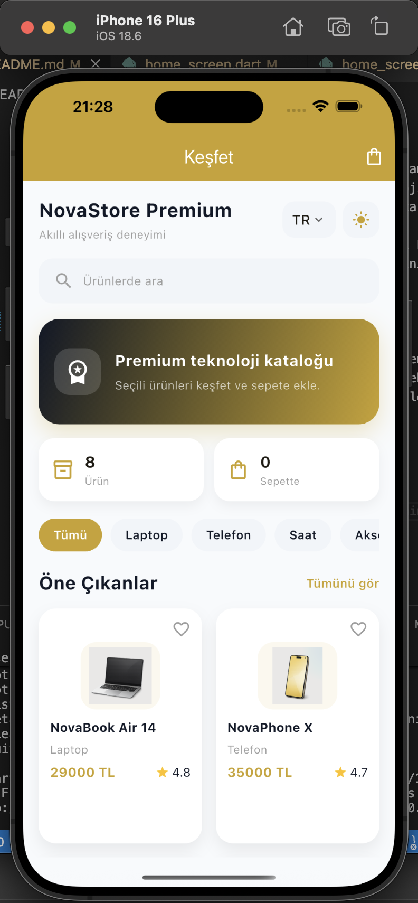
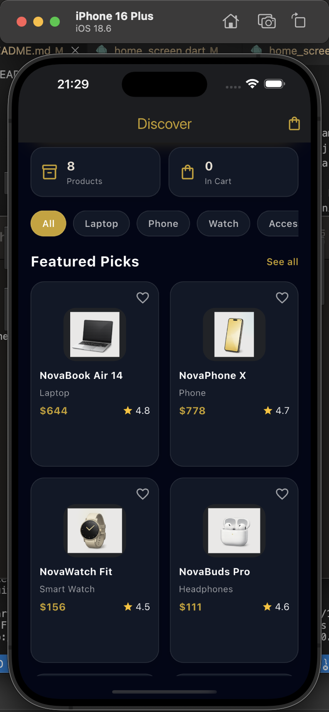
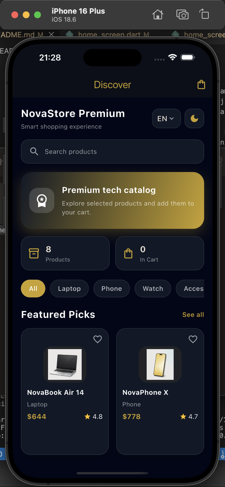
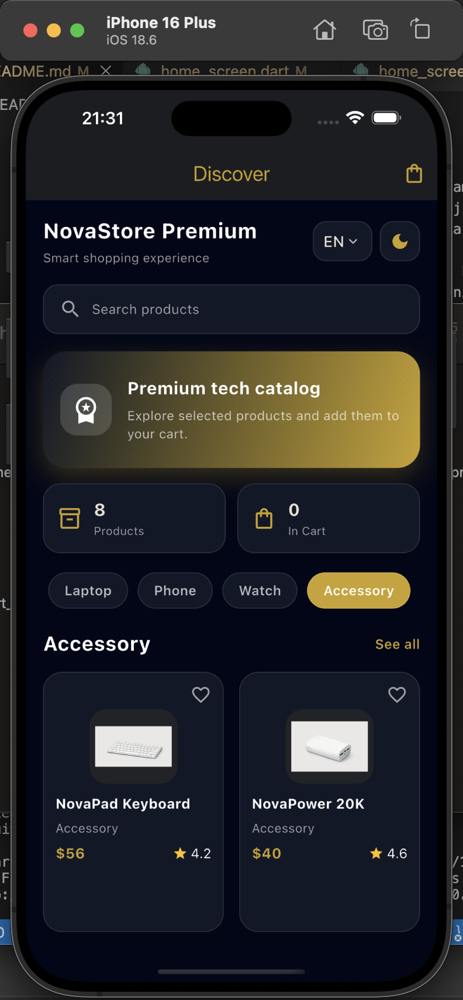
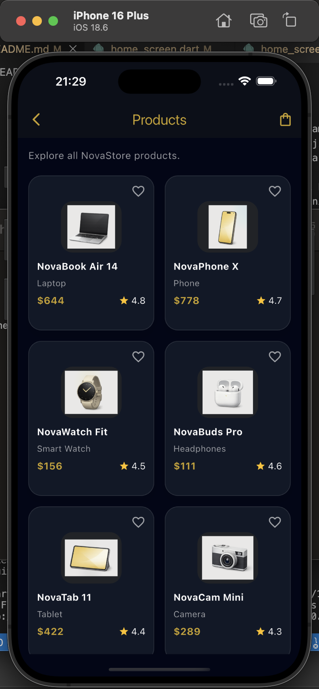
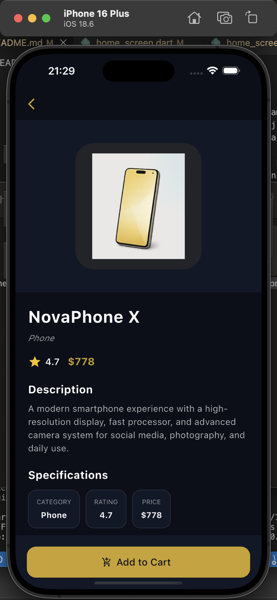
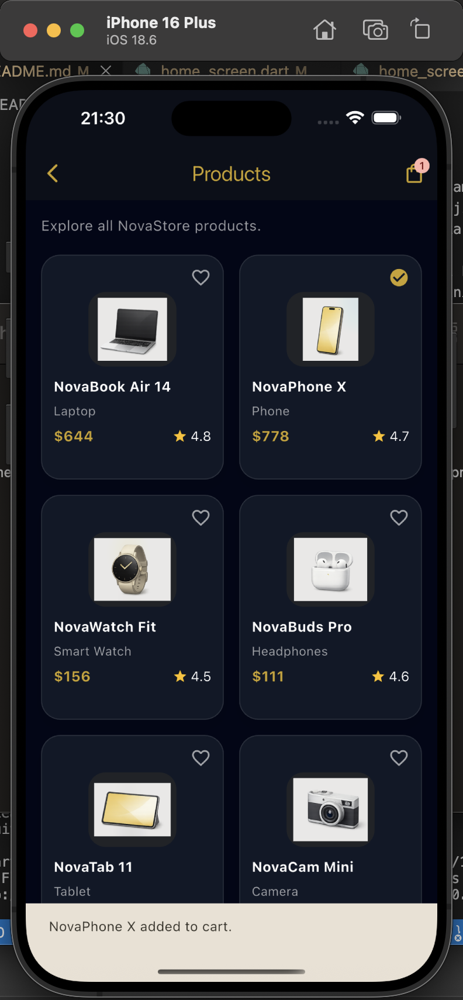
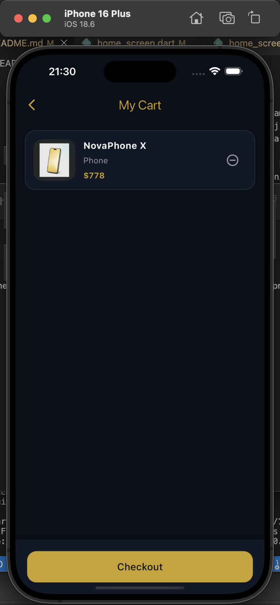
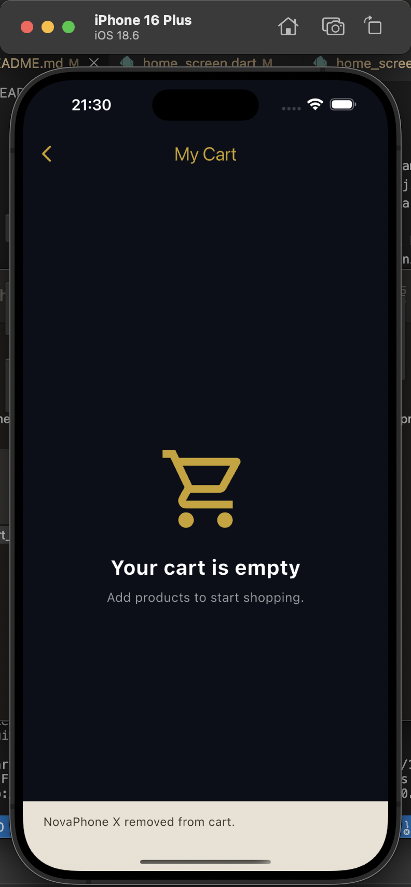
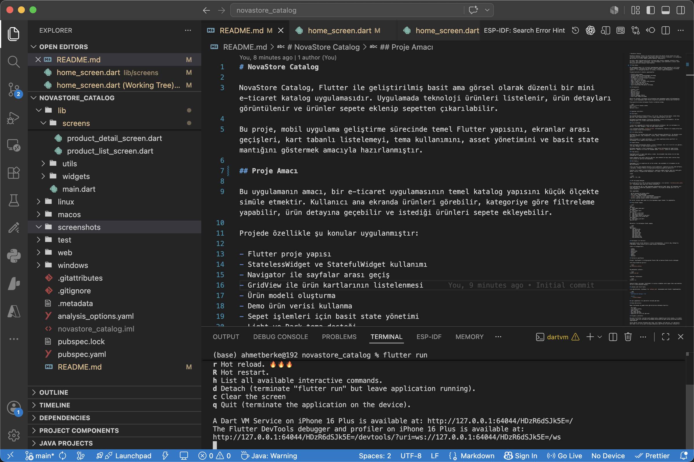

## Ekran Görüntüleri

Uygulamaya ait ekran görüntüleri `screenshots/` klasörü içinde tutulmuştur. Bu görseller, uygulamanın ana akışını ve temel özelliklerini göstermektedir.

### Ana Sayfa

### Ana Sayfa Kart Görünümü

### İngilizce Görünüm

### Kategori Filtreleme

### Tüm Ürünler

### Ürün Detayı

### Sepete Ürün Eklendi

### Sepet Ekranı

### Boş Sepet Ekranı

### Kod ve Proje Görünümü

